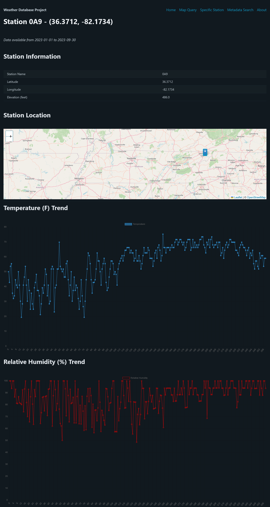
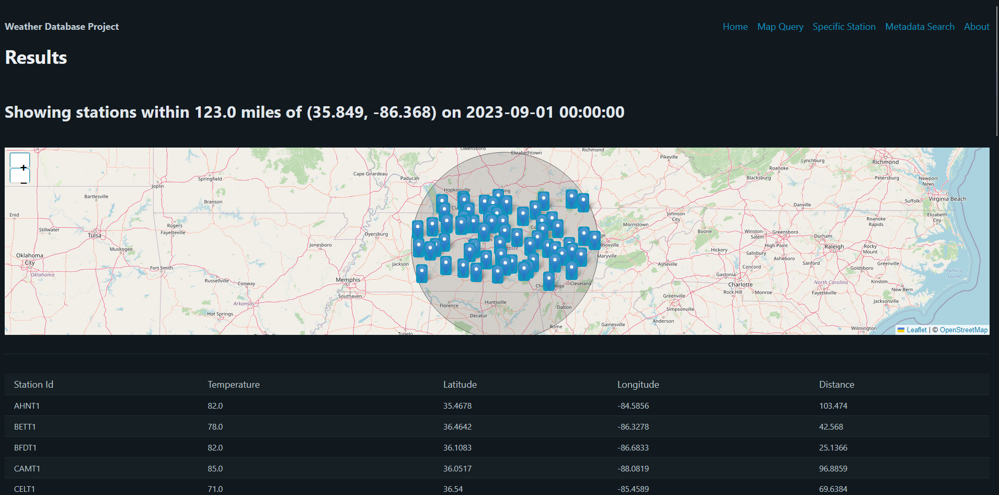

# Weather Database Project

# 🌦️🌤️💻

Welcome to our CSCI 4560/5560 Database project!

## Um... how do I run this?

- Start by updating the crendentials in `config.txt`
- You _should_ then be able to run `database.py` and get a final result

## Data Download

- You can download all of the processed data here: <https://mtmailmtsu-my.sharepoint.com/:f:/g/personal/imo2d_mtmail_mtsu_edu/EmpZ3SL8gpZJreuShq9Kbz0BrBJqdGDXYMxTSzaRa1fcWQ?e=h7k9qY>
- Put the data all in the same directory as the other scripts and you should be good to go!!

## Screenshots!






## Queries and Stuff

- Ability to query stations off of elevation ⚠️
- Ability to query stations based on radius lat/long; return temperature as a map ✅
- Ability to query for the closest station based on lat/long points and display "dashboard" view ✅


## Dependencies

* `sqlalchemy`
* The official MySQL Python adapter
* Download `coop.csv`, `asos.csv` and `asosMetadata.csv` as described below.
* `Flask`
* `pandas`

## Installation

* To install all of the dependencies for the project, run the following command:

```
$ pip install -r requirments.txt
```

* See <https://pip.pypa.io/en/stable/getting-started/#install-multiple-packages-using-a-requirements-file>

Flask examples: 

* <https://manojahi.medium.com/flask-html-template-with-mysql-2f3b9405d0e2>
* <https://dev.mysql.com/doc/connector-python/en/connector-python-example-cursor-select.html>
* <https://picocss.com/>


## TODO

* Need to incorporate COOP and ASOS data together on elevation query -> probably going to use `UNION ALL`
* Want to be able to incorporate more weather variables on the elevation query page -> just need to add some logic in the SQL query
* Let's add a page that just displays all of the available columns in each of the tables

## Data Sources

Data comes from IOWA Mesonet, specifically COOP and ASOS.

### COOP Metadata

<https://mesonet.agron.iastate.edu/sites/networks.php?network=TN_COOP&format=html&nohtml=on>

It's all HTML, so we should be able to use `pd.read_html` for this really well... <https://pandas.pydata.org/pandas-docs/stable/reference/api/pandas.read_html.html>

[And the obligatory long URL for data...](https://mesonet.agron.iastate.edu/request/coop/obs-dl.php?network=TN_COOP&station%5B%5D=SMVT1&station%5B%5D=ALMT1&station%5B%5D=ALLT1&station%5B%5D=ARMT1&station%5B%5D=AHNT1&station%5B%5D=BNCT1&station%5B%5D=BFDT1&station%5B%5D=BETT1&station%5B%5D=COAT1&station%5B%5D=BLVT1&station%5B%5D=BRTT1&station%5B%5D=BROT1&station%5B%5D=CRTT1&station%5B%5D=CENT1&station%5B%5D=CTET1&station%5B%5D=CHET1&station%5B%5D=CHFT1&station%5B%5D=CSTT1&station%5B%5D=LYCT1&station%5B%5D=CLKT1&station%5B%5D=CKV&station%5B%5D=CKRT1&station%5B%5D=CLVT1&station%5B%5D=CMBT1&station%5B%5D=COOT1&station%5B%5D=COVT1&station%5B%5D=CROT1&station%5B%5D=LWST1&station%5B%5D=DAHT1&station%5B%5D=BYDT1&station%5B%5D=DAYT1&station%5B%5D=DCTT1&station%5B%5D=DCKT1&station%5B%5D=DVRT1&station%5B%5D=DCRT1&station%5B%5D=DYBT1&station%5B%5D=ELZT1&station%5B%5D=ERWT1&station%5B%5D=NTFT1&station%5B%5D=JCKT1&station%5B%5D=CRST1&station%5B%5D=FBNT1&station%5B%5D=FCFT1&station%5B%5D=FAVT1&station%5B%5D=FYVT1&station%5B%5D=CELT1&station%5B%5D=FRAT1&station%5B%5D=GAIT1&station%5B%5D=GBOT1&station%5B%5D=GTNT1&station%5B%5D=GTLT1&station%5B%5D=MTLT1&station%5B%5D=STMT1&station%5B%5D=GVLT1&station%5B%5D=GRJT1&station%5B%5D=GEST1&station%5B%5D=HART1&station%5B%5D=HENT1&station%5B%5D=HOHT1&station%5B%5D=HTLT1&station%5B%5D=THWT1&station%5B%5D=BEMT1&station%5B%5D=JAMT1&station%5B%5D=JLTT1&station%5B%5D=JHNT1&station%5B%5D=KNGT1&station%5B%5D=KGST1&station%5B%5D=KINT1&station%5B%5D=KNXT1&station%5B%5D=MRX&station%5B%5D=LAFT1&station%5B%5D=LNCT1&station%5B%5D=LAWT1&station%5B%5D=LWNT1&station%5B%5D=LBNT1&station%5B%5D=LNNT1&station%5B%5D=LENT1&station%5B%5D=LEXT1&station%5B%5D=LNDT1&station%5B%5D=LBLT1&station%5B%5D=MNCT1&station%5B%5D=MAYT1&station%5B%5D=MCMT1&station%5B%5D=MEGT1&station%5B%5D=ZOOT1&station%5B%5D=MERT1&station%5B%5D=MILT1&station%5B%5D=MTET1&station%5B%5D=MTYT1&station%5B%5D=MGBT1&station%5B%5D=MRIT1&station%5B%5D=MOST1&station%5B%5D=MTCT1&station%5B%5D=MSLT1&station%5B%5D=BRGT1&station%5B%5D=MTPT1&station%5B%5D=MURT1&station%5B%5D=MSRT1&station%5B%5D=RBNT1&station%5B%5D=NEST1&station%5B%5D=NPTT1&station%5B%5D=OKRT1&station%5B%5D=NSHT1&station%5B%5D=OHIT1&station%5B%5D=HRTT1&station%5B%5D=ONET1&station%5B%5D=DCCT1&station%5B%5D=PART1&station%5B%5D=PRST1&station%5B%5D=PIKT1&station%5B%5D=PKET1&station%5B%5D=PRTT1&station%5B%5D=PULT1&station%5B%5D=LVNT1&station%5B%5D=RIPT1&station%5B%5D=RNMT1&station%5B%5D=RKIT1&station%5B%5D=RKWT1&station%5B%5D=RGRT1&station%5B%5D=KENT1&station%5B%5D=SVNT1&station%5B%5D=SELT1&station%5B%5D=BSAT1&station%5B%5D=SVRT1&station%5B%5D=TZET1&station%5B%5D=SWNT1&station%5B%5D=SHBT1&station%5B%5D=SMAT1&station%5B%5D=SMIT1&station%5B%5D=SRNT1&station%5B%5D=SODT1&station%5B%5D=SPAT1&station%5B%5D=SPET1&station%5B%5D=SPIT1&station%5B%5D=SPRT1&station%5B%5D=TELT1&station%5B%5D=TDUT1&station%5B%5D=TNRT1&station%5B%5D=THOT1&station%5B%5D=TNST1&station%5B%5D=TNET1&station%5B%5D=UNCT1&station%5B%5D=MART1&station%5B%5D=WPKT1&station%5B%5D=WART1&station%5B%5D=TULT1&station%5B%5D=DRET1&station%5B%5D=CVLT1&station%5B%5D=SHLT1&station%5B%5D=NORT1&station%5B%5D=HUNT1&station%5B%5D=WTRT1&station%5B%5D=WAVT1&station%5B%5D=WAYT1&station%5B%5D=WHST1&station%5B%5D=SEQT1&station%5B%5D=SAMT1&station%5B%5D=WCHT1&station%5B%5D=WEBT1&station%5B%5D=LKMT1&station%5B%5D=CAMT1&station%5B%5D=WOOT1&year1=2023&month1=1&day1=1&year2=2023&month2=10&day2=1&what=download&delim=comma)

Thanks, Iowa... Download this and save it as `coopData.csv`

### ASOS Data

To request 1 ASOS station:

<https://mesonet.agron.iastate.edu/cgi-bin/request/asos.py?station=MBT&data=all&year1=2023&month1=10&day1=10&year2=2023&month2=10&day2=10&tz=Etc%2FUTC&format=onlycomma&latlon=yes&elev=yes&missing=M&trace=T&direct=no&report_type=3&report_type=4>


Important notes here: 

- Encodes missing data as "M"
- Trace data is "T" - maybe just get rid of it?

Here's the URL to _technically_ pull them all:

### ASOS Metadata

So, our data for ASOS actually includes all of the metadata all ready, which is really nice...

[Really looooong link for the data](https://mesonet.agron.iastate.edu/cgi-bin/request/asos.py?station=0A9&station=1M5&station=2A0&station=2M2&station=8A3&station=BGF&station=BNA&station=CHA&station=CKV&station=CSV&station=DKX&station=DYR&station=FYE&station=FYM&station=GCY&station=GKT&station=GZS&station=HZD&station=JAU&station=JWN&station=LUG&station=M01&station=M02&station=M04&station=M08&station=M33&station=M54&station=M91&station=MBT&station=MEM&station=MKL&station=MMI&station=MNV&station=MOR&station=MQY&station=MRC&station=NQA&station=OQT&station=PHT&station=PVE&station=RKW&station=RNC&station=RZR&station=SCX&station=SNH&station=SRB&station=SYI&station=SZY&station=THA&station=TRI&station=TYS&station=UCY&station=XNX&data=all&year1=2023&month1=1&day1=1&year2=2023&month2=10&day2=1&tz=Etc%2FUTC&format=onlycomma&latlon=no&elev=no&missing=M&trace=T&direct=no&report_type=3&report_type=4)

[And the link for the metadata](https://mesonet.agron.iastate.edu/cgi-bin/request/asos.py?station=0A9&station=1M5&station=2A0&station=2M2&station=8A3&station=BGF&station=BNA&station=CHA&station=CKV&station=CSV&station=DKX&station=DYR&station=FYE&station=FYM&station=GCY&station=GKT&station=GZS&station=HZD&station=JAU&station=JWN&station=LUG&station=M01&station=M02&station=M04&station=M08&station=M33&station=M54&station=M91&station=MBT&station=MEM&station=MKL&station=MMI&station=MNV&station=MOR&station=MQY&station=MRC&station=NQA&station=OQT&station=PHT&station=PVE&station=RKW&station=RNC&station=RZR&station=SCX&station=SNH&station=SRB&station=SYI&station=SZY&station=THA&station=TRI&station=TYS&station=UCY&station=XNX&data=wxcodes&year1=2023&month1=1&day1=1&year2=2023&month2=1&day2=1&tz=Etc%2FUTC&format=onlycomma&latlon=yes&elev=yes&missing=M&trace=T&direct=no&report_type=3&report_type=4)

Nobody's got time for that... 🙄

For these, be sure to download these 2 files first... (Python doesn't like reading files that *big* over the internet...) Save them as `asos.csv` and `asosMetadata.csv`. 

Probably going to be `pd.read_csv` for this one <https://pandas.pydata.org/pandas-docs/stable/reference/api/pandas.read_csv.html>

## Data Limits

Not sure what dates we want to use yet? 

- I'm thinking something like Jan 1 2023 - September 31 2023?
- That's enough data to be interesting, but not so much to be troublesome...

## What about SQL?

I mean, this is a class about SQL after all...

So, it turns out Pandas can generate your schemas for you:

<https://stackoverflow.com/a/31075679>

Yay! This gets us our actual schemas with ~~little~~ no work on our part :)

Once we get our data, we can insert it into our tables too.

* <https://docs.sqlalchemy.org/en/20/core/engines.html>
* <https://pandas.pydata.org/pandas-docs/stable/reference/api/pandas.DataFrame.to_sql.html>

## Thank you, Iowa State!

```
Oopsy, something failed on our end, but fear not.
Please contact akrherz@iastate.edu and reference this unique identifier: X6D3Q2VNQSP8
Or wait a day for daryl to review the web logs and fix the bugs he wrote.  What a life.
```

## Sources

* Annoying ASCII art: <https://doodlenerd.com/web-tool/figlet-generator>
